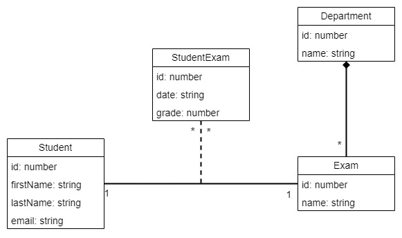

<center>



Model
</center>

# Baza

Radio sam sa mysql ali nema neke razlike sa postgresql jer sam napravio dinamicki modul (`database.module.ts`) pa
se baza moze lako promeniti izmenom .env-a.

# Moduli

Za svaki objekat sam napravio poseban modul osim za `StudentExam`, jer po meni nema smisla da to bude zaseban modul, uvek ce se koristiti uz `Student` ili `Exam`. Zato sam `StudentExamService` i `StudentExamRepository` registrovao kao provider-e u modulu studenta, a exam modul importuje student modul.

# Kontroleri i rute

## Student controller

Napravio sam globalni interceptor (**NotFoundInterceptor**) al sam stavio da ga samo ovaj kontroler koristi. Ako ne postoji npr. student sa odgovarajucim id-em onda se baca greska sa odgovarajucom porukom u respons-u.

*GET*: `http://localhost:3000/student` - vraca sve studente

*GET*: `http://localhost:3000/student/:id` - vraca studenta sa odgovarajucim id-em

*GET*: `http://localhost:3000/student/:id/exams` - vraca sva polaganja ispita za odgovarajuceg studenta

*POST*: `http://localhost:3000/student` - kreiranje studenta. Prosledjuje se CreateStudentDTO koji ima obavezna polja i string email mora biti tipa email:
```json
{
    "firstName": "Nikola",
    "lastName": "Stojilkovic",
    "yearStarted": "2019",
    "email": "nikola.stojilkovic6@gmail.com"
}
```

*PUT*: `http://localhost:3000/student/:id` - U servisu koji je odgovoran za ovaj zahtev sam probao upravljanje transakcijama. Napravio sam da moze samo da se izmeni email tako da body izgelda ovako:
```json
{
    "email": "nikola123@gmail.com"
}
```
*DELETE*: `http://localhost:3000/student/:id` - brise nekog studenta, nije dozvoljeno brisanje ako student ima zabelezana polaganja

## Department controller

*GET*: `http://localhost:3000/department` - vraca sve katedre

*GET*: `http://localhost:3000/department/:id` - vraca katedru sa odgovarajucim id-em

*POST*: `http://localhost:3000/department` - kreira novu katedru
Ukoliko je body ovog izgleda onda kreira katedru samo sa imenom:
```json
{
    "name": "katedra3"
}
```
Ukoliko se prosledi i neki ispit onda ce i on biti sacuvan:
```json
{
    "name": "katedra2",
    "exams": [
        {
            "name": "ispit1"
        }
    ]
}
```

# Exam controller

*GET*: `http://localhost:3000/exam/:id/attempts` - vraca sva polaganja jednog ispita

*POST*: `http://localhost:3000/exam` - kreiranje ispita
body:
```json
{
    "name": "ispit3",
    "department": 1
}
```

# StudentExam controller
U ovom kontroleru sam probao kako funkcionise ValidationPipe za transformaciju zahteva

*POST*: `http://localhost:3000/student/:studentId/exam/examId` - kreira polaganje studenta za odgovarajuci ispit. Ovde sam takodje probao upravljanje transakcijama
body: 
```json
{
    "grade": 8
}
```

*PUT*: `http://localhost:3000/exam/:id` - izmena ocene polaganja
body:
```json
{
    "grade": 9
}
```

